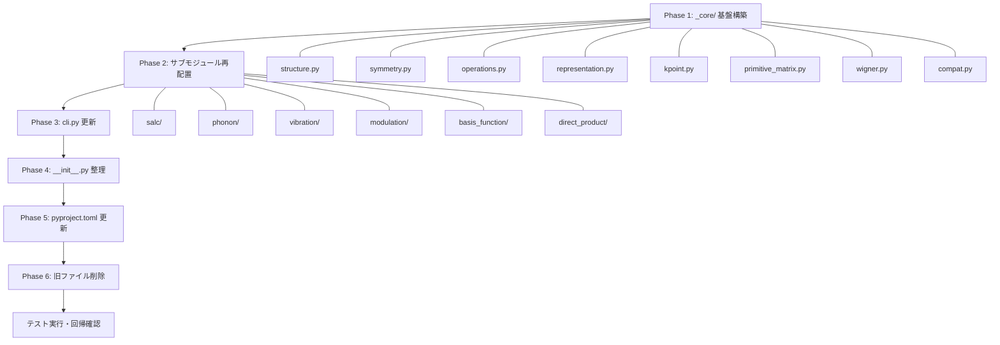

# CrystOD リファクタリング計画 (v0.2.0)

## 概要

CrystOD パッケージを以下の2点について整理する:

1. **phonopy への依存度削減**: 構造読み取り等を ASE に置き換え、phonopy は dynamical matrix 構築・フォノン既約表現・指標表データベースのみに限定
2. **パッケージ構造の整理**: 寄せ集めの個別コードを、spgrep のような組織的な構造に再編成

### 決定事項

| 項目 | 決定 |
|---|---|
| 指標表データベース | phonopy の `character_table` を引き続き参照する |
| Wigner-D 関連機能 | matsym から統合する（電子軌道描画用途） |
| バージョン | **0.2.0** |
| 後方互換リダイレクト | **なし** — 旧モジュール名での import は廃止。構造を一新する |
| CLI インターフェース | **変更なし** — `crystod --salc`, `crystod --vibration` 等の使い方はそのまま |

---

## 1. 現状分析

### 1.1 リポジトリ構成（現在）

```
CrystOD/
├── pyproject.toml
├── README.md
├── LICENSE
├── crystod/
│   ├── __init__.py
│   ├── __main__.py
│   ├── cli.py                            # 統合CLIエントリポイント
│   ├── crystal_orbital_spgrep.py          # SALC（単一元素モード） ~1100行
│   ├── orbital_hybridization_spgrep.py    # SALC（混成軌道モード） ~765行
│   ├── basis_function.py                  # 基底関数分類 ~736行
│   ├── phonon_irreps.py                   # フォノン既約表現ラベリング ~227行
│   ├── vibration_modes.py                 # 対称性のみ振動基底 ~523行
│   ├── vibration_viewer.py                # npz ビューア ~148行
│   ├── modulation.py                      # 対称性適応フォノン変調 ~423行
│   ├── direct_product.py                  # 直積分解 ~181行
│   ├── runtime_compat.py                  # phonopy/spgrep互換ヘルパー ~102行
│   ├── spglib_compat.py                   # spglib互換ヘルパー ~29行
│   └── irreptables_compat.py              # irreptables互換ヘルパー ~59行
└── example/
    ├── modulation/
    ├── phonon_irrep/
    ├── test_POSCARs/
    └── vibration/
```

### 1.2 phonopy 使用箇所の詳細マッピング

#### `crystal_orbital_spgrep.py`
| 行 | import / 使用 | 用途 | ASE 置換可否 |
|---|---|---|---|
| L18 | `from phonopy.structure.atoms import PhonopyAtoms` | 構造データの型として使用 | ✅ `ase.Atoms` に置換可 |
| L19 | `from phonopy.interface.calculator import read_crystal_structure` | POSCAR読み取り（`main()`内 L1015） | ✅ `ase.io.read` に置換可 |
| L20 | `from phonopy.structure.symmetry import Symmetry` | 対称性データセット取得（`__init__`内 L248） | ✅ `spglib.get_symmetry_dataset` に直接置換可 |

- `CrystalOrbital.__init__` で `PhonopyAtoms` を受け取り、`standardize_cell` → `PhonopyAtoms` を再構築
- `PhonopyAtoms.totuple()` で `(lattice, positions, numbers)` タプルを取得し spglib に渡す
- `PhonopyAtoms.cell`, `.scaled_positions`, `.get_chemical_symbols()` を参照

#### `orbital_hybridization_spgrep.py`
| 行 | import / 使用 | 用途 | ASE 置換可否 |
|---|---|---|---|
| L18 | `from phonopy.structure.atoms import PhonopyAtoms` | 同上 | ✅ |
| L19 | `from phonopy.interface.calculator import read_crystal_structure` | 同上 | ✅ |
| L20 | `from phonopy.structure.symmetry import Symmetry` | 同上 | ✅ |

#### `phonon_irreps.py`
| 行 | import / 使用 | 用途 | ASE 置換可否 |
|---|---|---|---|
| L29 | `from phonopy import load` | phonopy_params.yaml 読み込み、フォノン計算 | ❌ **phonopy 必須** |
| L30 | `from phonopy.structure.cells import get_primitive_matrix_by_centring` | centring 文字から primitive 行列取得 | ⚠️ 自前実装可能 |
| L187-193 | `phonon = load(...)` | FORCE_SETS/FORCE_CONSTANTS からフォノン計算 | ❌ **phonopy 必須** |
| L145 | `phonon.set_irreps(...)` | 既約表現計算 | ❌ **phonopy 必須** |

#### `vibration_modes.py`
| 行 | import / 使用 | 用途 | ASE 置換可否 |
|---|---|---|---|
| L17 | `from phonopy.structure.cells import get_primitive_matrix_by_centring` | centring → primitive 行列 | ⚠️ 自前実装可能 |
| L25 | `from phonopy.interface.calculator import read_crystal_structure` | POSCAR 読み取り | ✅ |
| L26 | `from phonopy.structure.atoms import PhonopyAtoms` | 構造データの型 | ✅ |

#### `modulation.py`
| 行 | import / 使用 | 用途 | ASE 置換可否 |
|---|---|---|---|
| L12 | `import phonopy` | `phonopy.load()` で yaml 読み込み | ❌ **dynamical matrix に必須** |
| L23 | `from phonopy.structure.atoms import PhonopyAtoms` | primitive cell 構築 | ✅ |
| L198 | `self.phonon = phonopy.load(yaml_path)` | フォノンデータ読み込み | ❌ **phonopy 必須** |
| L199 | `dynamical_matrix = self.phonon.dynamical_matrix` | ダイナミカル行列取得 | ❌ **phonopy 必須** |
| L214 | `dynamical_matrix.run(qpoint)` | q点でのDM計算 | ❌ **phonopy 必須** |

#### `basis_function.py`
| 行 | import / 使用 | 用途 | ASE 置換可否 |
|---|---|---|---|
| L6 | `from phonopy.phonon.character_table import character_table` | 点群の指標表 | ❌ **phonopy を引き続き使用（決定事項）** |
| L7 | `from phonopy.structure.cells import get_primitive_matrix_by_centring` | centring → primitive 行列 | ⚠️ 自前実装可能 |

#### `direct_product.py`
| 行 | import / 使用 | 用途 | ASE 置換可否 |
|---|---|---|---|
| L6 | `from phonopy.phonon.character_table import character_table` | 点群の指標表 | ❌ **phonopy を引き続き使用（決定事項）** |

#### `runtime_compat.py`
- `get_chemical_symbols()`, `get_scaled_positions()` → ASE なら不要
- `get_symmetry_dataset()` → spglib 直接呼び出しに変更
- spgrep の import パス解決（`get_character`, `get_little_group`）→ compat に残す

#### `spglib_compat.py`
- phonopy が旧い spglib レイアウトを期待する問題への対処
- phonopy を残すモジュール（modulation, phonon_irreps）では引き続き必要

### 1.3 phonopy 依存の分類サマリー

| カテゴリ | ファイル | 使用 API | 判定 |
|---|---|---|---|
| **構造読み取り** | crystal_orbital, orbital_hybridization, vibration_modes | `read_crystal_structure`, `PhonopyAtoms` | ✅ ASE に置換 |
| **対称性取得** | crystal_orbital, orbital_hybridization | `Symmetry` クラス | ✅ spglib 直接 |
| **primitive 行列** | phonon_irreps, vibration_modes, basis_function | `get_primitive_matrix_by_centring` | ✅ 自前実装 |
| **指標表データベース** | direct_product, basis_function | `character_table` | ❌ phonopy 維持（決定事項） |
| **フォノン計算** | phonon_irreps | `phonopy.load`, `set_irreps` | ❌ phonopy 必須 |
| **dynamical matrix** | modulation | `phonopy.load`, `dynamical_matrix` | ❌ phonopy 必須 |

### 1.4 matsym から統合する機能

matsym リポジトリ (`/Users/hiroki_koiso/Documents/GitHub/matsym/matsym/operations.py`) の以下の関数を CrystOD に統合する:

| 関数名 | 行 | 用途 |
|---|---|---|
| `rotation_matrix_to_euler_zyz(R)` | L107-118 | 回転行列 → ZYZ Euler 角変換 |
| `complex_to_real_transform(l)` | L120-140 | 複素球面調和基底 → 実球面調和基底 変換行列 |
| `complex_to_real_transform_orbital(l)` | L142-194 | 複素球面調和 → 軌道基底 (p_x,p_y,p_z / d_xy,...) 変換行列。l=1,2,3 に特化 |
| `wigner_D_matrix(l, R)` | L196-200 | Wigner D行列（複素）。sympy の `wigner_d` を使用 |
| `wigner_D_real(l, R)` | L202-209 | 実軌道基底での Wigner D行列。反転操作も処理 |

**依存**: `sympy.physics.wigner.wigner_d`, `sympy.N`（すでに crystod の依存に `sympy` あり）

---

## 2. 新しいパッケージ構造

```
CrystOD/
├── pyproject.toml                    # 依存関係更新、version=0.2.0
├── README.md
├── LICENSE
├── crystod/
│   ├── __init__.py                   # version, 公開APIエクスポート
│   ├── __main__.py                   # python -m crystod
│   ├── cli.py                        # 統合CLIエントリポイント（import パスのみ変更）
│   │
│   ├── _core/                        # 内部共通基盤（非公開）
│   │   ├── __init__.py
│   │   ├── structure.py              # [NEW] ASEベースの構造I/O・操作ユーティリティ
│   │   ├── symmetry.py               # [NEW] spglibベースの対称性操作ラッパー
│   │   ├── operations.py             # [NEW] 回転特性化・Seitz記号（既存各所から統合）
│   │   ├── representation.py         # [NEW] 置換行列・群表現の共通ロジック
│   │   ├── kpoint.py                 # [NEW] k点正規化・高対称点解決
│   │   ├── primitive_matrix.py       # [NEW] centring → primitive 行列（phonopy非依存）
│   │   ├── wigner.py                 # [NEW] Wigner D行列・軌道基底変換（matsymから統合）
│   │   └── compat.py                 # [MERGE] runtime_compat + spglib_compat + irreptables_compat
│   │
│   ├── salc/                         # SALC / Crystal Orbital / Band Rep
│   │   ├── __init__.py
│   │   ├── crystal_orbital.py        # [REFACTOR] crystal_orbital_spgrep.py → CrystalOrbital
│   │   ├── hybridization.py          # [REFACTOR] orbital_hybridization_spgrep.py
│   │   └── irrep_labeling.py         # [EXTRACT] irrep ラベルマッチングロジック（重複排除）
│   │
│   ├── phonon/                       # フォノン関連（phonopy 依存をここに集約）
│   │   ├── __init__.py
│   │   ├── irreps.py                 # [MOVE] phonon_irreps.py
│   │   └── character_table.py        # [NEW] phonopy.phonon.character_table のラッパー
│   │
│   ├── vibration/                    # 対称性のみ振動解析
│   │   ├── __init__.py
│   │   ├── modes.py                  # [REFACTOR] vibration_modes.py
│   │   └── viewer.py                 # [MOVE] vibration_viewer.py
│   │
│   ├── modulation/                   # 対称性適応フォノン変調（phonopy 依存をここに集約）
│   │   ├── __init__.py
│   │   └── modulation.py             # [REFACTOR] modulation.py
│   │
│   ├── basis_function/               # 基底関数分類
│   │   ├── __init__.py
│   │   └── basis_function.py         # [MOVE] basis_function.py
│   │
│   └── direct_product/               # 直積分解
│       ├── __init__.py
│       └── direct_product.py         # [MOVE] direct_product.py
│
└── example/                          # 既存のまま
    ├── modulation/
    ├── phonon_irrep/
    ├── test_POSCARs/
    └── vibration/
```

---

## 3. 実装の詳細手順

### Phase 1: `_core/` 基盤の構築

この Phase では新しいファイルのみ作成し、既存コードには一切触れない。

---

#### 3.1.1 `crystod/_core/__init__.py`

```python
"""Internal core utilities for crystod."""
```

---

#### 3.1.2 `crystod/_core/structure.py` [NEW]

**目的**: `PhonopyAtoms` を `ase.Atoms` に完全置換する統一的な構造操作レイヤー

**提供する関数**:

```python
"""ASE-based structure I/O and manipulation utilities."""

from __future__ import annotations
import numpy as np
from ase import Atoms
from ase.io import read as ase_read
import spglib


def read_structure(filepath: str, format: str = "vasp") -> Atoms:
    """Read a crystal structure file and return an ASE Atoms object.
    phonopy.interface.calculator.read_crystal_structure の置換。
    """
    return ase_read(filepath, format=format)


def to_spglib_cell(atoms: Atoms) -> tuple:
    """Convert ASE Atoms to spglib cell tuple (lattice, positions, numbers).
    PhonopyAtoms.totuple() の置換。
    """
    return (
        atoms.cell.array.copy(),
        atoms.get_scaled_positions(),
        atoms.numbers.copy(),
    )


def from_spglib_cell(lattice, positions, numbers) -> Atoms:
    """Create ASE Atoms from spglib cell components."""
    return Atoms(
        numbers=numbers,
        scaled_positions=positions,
        cell=lattice,
        pbc=True,
    )


def standardize_to_primitive(atoms: Atoms, symprec: float = 1e-5) -> Atoms:
    """Convert a structure to its primitive cell using spglib.
    spglib.standardize_cell + PhonopyAtoms 再構築の置換。
    """
    cell = to_spglib_cell(atoms)
    result = spglib.standardize_cell(cell, to_primitive=True, symprec=symprec)
    if result is None:
        raise RuntimeError("spglib.standardize_cell failed.")
    return from_spglib_cell(*result)
```

**実装者への注意 — PhonopyAtoms と ase.Atoms のプロパティ対応表**:

| PhonopyAtoms | ase.Atoms | 備考 |
|---|---|---|
| `.totuple()` | `to_spglib_cell(atoms)` | `(lattice, positions, numbers)` タプル |
| `.cell` | `.cell.array` | PhonopyAtoms.cell は ndarray、ASE は Cell オブジェクト |
| `.scaled_positions` | `.get_scaled_positions()` | 同じ結果 |
| `.get_chemical_symbols()` | `.get_chemical_symbols()` | 同じ API |
| `.numbers` | `.numbers` | 同じ API |
| `PhonopyAtoms(numbers=..., scaled_positions=..., cell=...)` | `from_spglib_cell(cell, positions, numbers)` |  |

---

#### 3.1.3 `crystod/_core/symmetry.py` [NEW]

**目的**: spglib による対称性データセット取得を統一化。`phonopy.structure.symmetry.Symmetry` を排除。

```python
"""Symmetry dataset acquisition via spglib (replacing phonopy.structure.symmetry.Symmetry)."""

from __future__ import annotations
import spglib
from ase import Atoms
from crystod._core.structure import to_spglib_cell


class SymmetryDataset:
    """Wrapper around spglib symmetry dataset with stable attribute access.
    runtime_compat.py の SymmetryDatasetAdapter を統合・簡素化。
    """

    def __init__(self, dataset):
        self._dataset = dataset

    @property
    def rotations(self):
        return self._dataset.rotations

    @property
    def translations(self):
        return self._dataset.translations

    @property
    def international(self):
        return self._dataset.international

    @property
    def number(self):
        return self._dataset.number

    @property
    def hall(self):
        return self._dataset.hall

    @property
    def wyckoffs(self):
        return self._dataset.wyckoffs

    @property
    def pointgroup(self):
        return self._dataset.pointgroup

    def __getitem__(self, key):
        return getattr(self._dataset, key)


def get_symmetry_dataset(atoms: Atoms, symprec: float = 1e-5) -> SymmetryDataset:
    """Get symmetry dataset from ASE Atoms using spglib directly.
    phonopy.structure.symmetry.Symmetry の置換。
    """
    cell = to_spglib_cell(atoms)
    raw = spglib.get_symmetry_dataset(cell, symprec=symprec)
    if raw is None:
        raise RuntimeError("spglib.get_symmetry_dataset failed.")
    return SymmetryDataset(raw)
```

**実装者への注意**:
- 現在のコード（crystal_orbital_spgrep.py L248付近）:
  ```python
  symmetry = Symmetry(self.primitive_cell)  # phonopy の Symmetry
  dataset = get_symmetry_dataset(symmetry)  # runtime_compat の関数
  ```
  これを:
  ```python
  dataset = get_symmetry_dataset(self.primitive_cell, symprec=symprec)  # 新しい _core.symmetry の関数
  ```
  に置換する。

---

#### 3.1.4 `crystod/_core/operations.py` [NEW — 複数ソースから統合]

**目的**: 回転操作の特性化・Seitz 記号生成を共通モジュールに集約

**統合元**:
- `crystal_orbital_spgrep.py` の `characterize_rotation()` (L127-147), `get_seitz_symbol()` (L149-226), `similarity_transformation()` (L71-73)
- `orbital_hybridization_spgrep.py` の同一コード
- matsym `operations.py` の `characterize_rotation()`, `get_seitz_symbol()`

**提供する関数**:
```python
def characterize_rotation(R) -> tuple[bool, int]:
    """Characterize rotation: returns (is_proper, rot_order)."""

def get_seitz_symbol(R, trans_mat) -> str:
    """Get Seitz notation for the rotation part of a symmetry operation."""

def similarity_transformation(U, M):
    """U M U^{-1}"""
    return U @ M @ np.linalg.inv(U)
```

**実装者への注意**:
- 現在4箇所に完全に同一のコードが重複している
- matsym 版と crystod 版は内容は同一だが、matsym の方が `wigner_D` 等の追加機能がある（それは `wigner.py` に分離）

---

#### 3.1.5 `crystod/_core/representation.py` [NEW — 共通ロジック抽出]

**目的**: 置換行列計算など、SALC/振動/変調で共有される群表現ロジック

**統合元**: 以下の4箇所にある **全く同じロジック** を集約
- `crystal_orbital_spgrep.py` L783-830
- `orbital_hybridization_spgrep.py` L433-480
- `modulation.py` L111-144
- `vibration_modes.py` L126-166

```python
"""Common group representation utilities."""

from __future__ import annotations
import numpy as np
from numpy.typing import NDArray


def get_modified_permutation_rep(
    rotation: NDArray[np.int_],
    translation: NDArray[np.float64],
    kpoint: list[float],
    scaled_positions: NDArray[np.float64],
) -> NDArray[np.complex128]:
    """Compute the modified permutation representation matrix at a k-point.
    
    全4モジュール共通の置換行列計算。各クラスからラッパー経由で呼び出す。
    """
    n_atoms = len(scaled_positions)
    matrix = np.zeros((n_atoms, n_atoms), dtype=complex)
    for i, pos_i in enumerate(scaled_positions):
        pos_rot = np.dot(rotation, pos_i) + translation
        for j, pos_j in enumerate(scaled_positions):
            diff = pos_rot - pos_j
            if (abs(diff - np.rint(diff)) < 1e-5).all():
                phase_factor = np.dot(
                    kpoint,
                    np.dot(np.linalg.inv(rotation), pos_j - translation) - pos_j,
                )
                matrix[j, i] = np.exp(2j * np.pi * phase_factor)
    return matrix


def get_permutation_reps_at_k(
    rotations: NDArray[np.int_],
    translations: NDArray[np.float64],
    kpoint: list[float],
    scaled_positions: NDArray[np.float64],
) -> NDArray[np.complex128]:
    """Compute permutation representation matrices for all operations at k."""
    return np.array(
        [
            get_modified_permutation_rep(r, t, kpoint, scaled_positions)
            for r, t in zip(rotations, translations)
        ],
        dtype=np.complex128,
    )
```

---

#### 3.1.6 `crystod/_core/kpoint.py` [NEW — 共通ロジック抽出]

**目的**: k 点正規化・高対称点解決ロジックの集約

**統合元**:
- `crystal_orbital_spgrep.py` の `canonicalize_kpoint()`, `format_kpoint()` (L76-98 付近)
- `vibration_modes.py` の `resolve_qpoint()`, `get_high_symmetry_qpoints()` (L179-224 付近)

```python
"""K-point normalization and high-symmetry point resolution."""

def canonicalize_kpoint(k):
    """Normalize k-point to [0, 1) range."""

def format_kpoint(k):
    """Format k-point for display."""

def resolve_qpoint(qpoint_arg, atoms, symprec=1e-5):
    """Resolve q-point argument: either numeric [kx, ky, kz] or label like 'R', 'GM'."""

def get_high_symmetry_qpoints(atoms, symprec=1e-5):
    """Get high-symmetry k-points using seekpath."""
```

---

#### 3.1.7 `crystod/_core/primitive_matrix.py` [NEW — phonopy 非依存化]

**目的**: `phonopy.structure.cells.get_primitive_matrix_by_centring` の自前実装

```python
"""Primitive matrix from centring symbol (replacing phonopy dependency)."""

import numpy as np
from numpy.typing import NDArray


def get_primitive_matrix_by_centring(centring: str) -> NDArray[np.float64]:
    """Return the transformation matrix from conventional to primitive cell.

    Parameters
    ----------
    centring : str
        First character of the international symbol: P, F, I, A, B, C, R.

    Returns
    -------
    matrix : (3, 3) float array
    """
    centring = centring.upper()
    matrices = {
        "P": [[1, 0, 0], [0, 1, 0], [0, 0, 1]],
        "F": [[0, 0.5, 0.5], [0.5, 0, 0.5], [0.5, 0.5, 0]],
        "I": [[-0.5, 0.5, 0.5], [0.5, -0.5, 0.5], [0.5, 0.5, -0.5]],
        "A": [[1, 0, 0], [0, 0.5, -0.5], [0, 0.5, 0.5]],
        "B": [[0.5, 0, -0.5], [0, 1, 0], [0.5, 0, 0.5]],
        "C": [[0.5, 0.5, 0], [-0.5, 0.5, 0], [0, 0, 1]],
        "R": [[2/3, -1/3, -1/3], [1/3, 1/3, -2/3], [1/3, 1/3, 1/3]],
    }
    if centring not in matrices:
        raise ValueError(f"Unknown centring type: {centring}")
    return np.array(matrices[centring], dtype=np.float64)
```

**実装者への注意**:
- phonopy の `get_primitive_matrix_by_centring` と完全に同じ変換行列を返すこと
- テスト時に phonopy の出力と比較して一致を確認すること

---

#### 3.1.8 `crystod/_core/wigner.py` [NEW — matsym から統合]

**目的**: Wigner D行列計算・軌道基底変換。電子軌道描画に使用。

**統合元**: matsym `operations.py` L107-209

```python
"""Wigner D-matrix and orbital basis transformation utilities.

Provides:
- Wigner D-matrix computation (complex and real orbital bases)
- Complex-to-real spherical harmonic transformation matrices
- Orbital-specific basis transformations (p, d, f orbitals)

These are used for orbital symmetry analysis and visualization.
"""

from __future__ import annotations
from math import atan2, acos
import numpy as np
from numpy.typing import NDArray
from sympy.physics.wigner import wigner_d
from sympy import N


def rotation_matrix_to_euler_zyz(R: NDArray) -> tuple[float, float, float]:
    """Convert 3x3 rotation matrix to ZYZ Euler angles (alpha, beta, gamma)."""
    beta = acos(np.clip(R[2, 2], -1.0, 1.0))
    if np.isclose(beta, 0):
        alpha = 0
        gamma = atan2(R[1, 0], R[0, 0])
    elif np.isclose(beta, np.pi):
        alpha = 0
        gamma = -atan2(R[1, 0], R[0, 0])
    else:
        alpha = atan2(R[1, 2], R[0, 2])
        gamma = atan2(R[2, 1], -R[2, 0])
    return alpha, beta, gamma


def complex_to_real_transform(l: int) -> NDArray[np.complex128]:
    """Transformation matrix from complex to real spherical harmonics basis.
    
    複素球面調和基底 (m=-l..l) → 実球面調和基底への変換行列。
    """
    n = 2 * l + 1
    C = np.zeros((n, n), dtype=complex)
    m_vals = np.arange(-l, l + 1)
    idx = 0
    for m in m_vals:
        if m < 0:
            C[idx, l + m] = 1j / np.sqrt(2)
            C[idx, l - m] = -((-1) ** abs(m)) * 1j / np.sqrt(2)
        elif m == 0:
            C[idx, l] = 1
        else:
            C[idx, l - m] = 1 / np.sqrt(2)
            C[idx, l + m] = ((-1) ** abs(m)) / np.sqrt(2)
        idx += 1
    return C


def complex_to_real_transform_orbital(l: int) -> NDArray[np.complex128]:
    """Transformation matrix from complex spherical harmonics to orbital basis.

    Provides specialized transformations for:
    - l=1: [p_x, p_y, p_z]
    - l=2: [d_xy, d_yz, d_z^2, d_xz, d_x^2-y^2]
    - l=3: [f_x(x^2-3y^2), f_y(3x^2-y^2), f_z(x^2-y^2), f_xyz, f_xz^2, f_yz^2, f_z^3]
    - l>3 or l=0: standard real spherical harmonics
    """
    # ... (matsym/operations.py L142-194 の全コードをそのまま移植)


def wigner_D_matrix(l: int, R: NDArray) -> NDArray[np.complex128]:
    """Compute the Wigner D-matrix (complex basis) for angular momentum l and rotation R.
    
    Uses sympy's wigner_d for exact computation.
    """
    alpha, beta, gamma = rotation_matrix_to_euler_zyz(R)
    D_sym = wigner_d(l, alpha, beta, gamma)
    D = np.array(D_sym.applyfunc(N), dtype=complex)
    return D


def wigner_D_real(l: int, R: NDArray) -> NDArray[np.float64]:
    """Compute the Wigner D-matrix in real orbital basis.

    Handles improper rotations (reflections, inversions) by factoring out det(R).

    Parameters
    ----------
    l : int
        Angular momentum quantum number.
    R : (3, 3) array
        Rotation (or improper rotation) matrix.

    Returns
    -------
    D_real : (2l+1, 2l+1) real array
    """
    det = np.linalg.det(R)
    R_proper = det * R  # Remove inversion to get SO(3) matrix
    D_complex = wigner_D_matrix(l, R_proper)
    C = complex_to_real_transform_orbital(l)
    C_inv = np.linalg.inv(C)
    D_real = (C @ D_complex @ C_inv) * det
    return np.real_if_close(D_real)
```

**実装者への注意**:
- matsym `operations.py` L107-209 のコードを **そのまま移植** する
- `complex_to_real_transform_orbital` の l=1,2,3 の個別ケースは正確にコピーすること（行列の各要素が物理的な軌道に対応している）
- `sympy` は crystod の既存依存（`pyproject.toml` に記載済み）なので追加不要

---

#### 3.1.9 `crystod/_core/compat.py` [MERGE — 3ファイル統合]

**目的**: 3つの互換モジュールを統合

**統合元**:
- `runtime_compat.py` → spgrep の import パス解決（`get_character`, `get_little_group`）
- `spglib_compat.py` → `ensure_spglib_compat()`
- `irreptables_compat.py` → `load_irreptables()`, `_wrap_irreptable()`

```python
"""Compatibility helpers for spgrep, spglib, and irreptables."""

# --- spgrep import path compat ---
try:
    from spgrep.rep.representation import get_character  # type: ignore
except Exception:
    from spgrep.representation import get_character  # type: ignore

try:
    from spgrep.symmetry.group import get_little_group  # type: ignore
except Exception:
    from spgrep.group import get_little_group  # type: ignore

# --- spglib compat (for phonopy) ---
def ensure_spglib_compat() -> None:
    """Provide spglib.spglib for phonopy versions that still import it."""
    ...  # spglib_compat.py の内容をそのまま

# --- irreptables compat ---
def load_irreptables():
    """Return (IrrepTable, Irrep) across irreptables package versions."""
    ...  # irreptables_compat.py の内容をそのまま
```

**実装者への注意**:
- `runtime_compat.py` の `SymmetryDatasetAdapter`, `get_symmetry_dataset()`, `get_pointgroup_symbol()`, `get_chemical_symbols()`, `get_scaled_positions()` は **削除**（`_core/symmetry.py` と ASE への移行で不要になる）
- spgrep の import パス解決と `ensure_spglib_compat` と irreptables compat のみを残す

---

### Phase 2: サブモジュールへの再配置

Phase 1 の `_core/` 完成後に実施。各ファイルを新しい場所に移動し、import を更新する。

---

#### 3.2.1 `crystod/salc/` [REFACTOR]

##### `crystod/salc/__init__.py`
```python
from .crystal_orbital import CrystalOrbital
```

##### `crystod/salc/crystal_orbital.py` — `crystal_orbital_spgrep.py` から

**変更点一覧**:

| 変更前 | 変更後 |
|---|---|
| `from phonopy.structure.atoms import PhonopyAtoms` | 削除 |
| `from phonopy.interface.calculator import read_crystal_structure` | `from crystod._core.structure import read_structure` |
| `from phonopy.structure.symmetry import Symmetry` | 削除 |
| `from phonopy.structure.cells import get_primitive_matrix_by_centring` | `from crystod._core.primitive_matrix import get_primitive_matrix_by_centring` |
| `self.primitive_cell.totuple()` | `to_spglib_cell(self.primitive_cell)` |
| `self.primitive_cell.cell` (lattice access) | `self.primitive_cell.cell.array` |
| `characterize_rotation()` (ローカル定義) | `from crystod._core.operations import characterize_rotation` |
| `get_seitz_symbol()` (ローカル定義) | `from crystod._core.operations import get_seitz_symbol` |
| `similarity_transformation()` (ローカル定義) | `from crystod._core.operations import similarity_transformation` |
| `canonicalize_kpoint()` (ローカル定義) | `from crystod._core.kpoint import canonicalize_kpoint` |

**`__init__` の書き換え**:
```python
# BEFORE:
cell: PhonopyAtoms
(primitive_lattice, primitive_pos, primitive_numbers) = standardize_cell(cell.totuple(), to_primitive=True, symprec=symprec)
self.primitive_cell = PhonopyAtoms(numbers=primitive_numbers, scaled_positions=primitive_pos, cell=primitive_lattice)
symmetry = Symmetry(self.primitive_cell)
dataset = get_symmetry_dataset(symmetry)  # runtime_compat の関数
self.rotations, self.translations = dataset['rotations'], dataset['translations']
self.transformation_matrix = get_primitive_matrix_by_centring(dataset['international'][0])

# AFTER:
cell: ase.Atoms
from crystod._core.structure import standardize_to_primitive, to_spglib_cell
from crystod._core.symmetry import get_symmetry_dataset
from crystod._core.primitive_matrix import get_primitive_matrix_by_centring
self.primitive_cell = standardize_to_primitive(cell, symprec=symprec)
dataset = get_symmetry_dataset(self.primitive_cell, symprec=symprec)
self.rotations = dataset.rotations
self.translations = dataset.translations
self.transformation_matrix = get_primitive_matrix_by_centring(dataset.international[0])
```

**`main()` の書き換え**:
```python
# BEFORE:
cell, _ = read_crystal_structure(args.poscar, interface_mode='vasp')
crystal_orbital = CrystalOrbital(cell=cell, ...)

# AFTER:
from crystod._core.structure import read_structure
atoms = read_structure(args.poscar)
crystal_orbital = CrystalOrbital(cell=atoms, ...)
```

##### `crystod/salc/hybridization.py` — `orbital_hybridization_spgrep.py` から

- `crystal_orbital.py` と全く同じパターンの変更を適用
- 重複コード（置換行列計算、Seitz記号等）は `_core` から import

##### `crystod/salc/irrep_labeling.py` [NEW — 重複排除]

- `crystal_orbital_spgrep.py` と `orbital_hybridization_spgrep.py` の irrep ラベリング関連で重複しているコードを抽出
- `get_irrep_labels()`, `irrep_label_sort_key()`, `sort_irrep_items()` を共通化

---

#### 3.2.2 `crystod/phonon/` [MOVE + WRAP]

##### `crystod/phonon/__init__.py`
```python
from .character_table import get_character_table
```

##### `crystod/phonon/irreps.py` — `phonon_irreps.py` から

**変更点**:
| 変更前 | 変更後 |
|---|---|
| `from phonopy.structure.cells import get_primitive_matrix_by_centring` | `from crystod._core.primitive_matrix import get_primitive_matrix_by_centring` |
| `from phonopy import load` | そのまま（**phonopy 必須**） |
| `phonon.set_irreps(...)` | そのまま（**phonopy 必須**） |

##### `crystod/phonon/character_table.py` [NEW]

**目的**: `phonopy.phonon.character_table` のラッパー。指標表アクセスを一箇所に集約。

```python
"""Point-group character table access via phonopy."""

from phonopy.phonon.character_table import character_table as _all_character_tables


def get_character_table(point_group: str) -> dict:
    """Get the character table for a point group.

    Parameters
    ----------
    point_group : str
        Point group symbol (e.g., "m-3m", "4/mmm").

    Returns
    -------
    table : dict
        Character table data from phonopy.
    """
    try:
        return _all_character_tables[point_group][0]
    except KeyError as exc:
        available = ", ".join(sorted(_all_character_tables.keys()))
        raise SystemExit(
            f'ERROR: "{point_group}" is not in the point groups.\n'
            f"Choose from: {available}"
        ) from exc
```

---

#### 3.2.3 `crystod/vibration/` [REFACTOR]

##### `crystod/vibration/__init__.py`
```python
from .modes import SymmetryOnlyVibrations
```

##### `crystod/vibration/modes.py` — `vibration_modes.py` から

**変更点**:
| 変更前 | 変更後 |
|---|---|
| `from phonopy.structure.atoms import PhonopyAtoms` | 削除 |
| `from phonopy.interface.calculator import read_crystal_structure` | `from crystod._core.structure import read_structure` |
| `from phonopy.structure.cells import get_primitive_matrix_by_centring` | `from crystod._core.primitive_matrix import get_primitive_matrix_by_centring` |
| `_CoreRepresentation` クラス内の置換行列計算 | `from crystod._core.representation import get_permutation_reps_at_k` |
| k点解決ロジック（`resolve_qpoint` 等） | `from crystod._core.kpoint import resolve_qpoint` |
| `cell.totuple()` | `to_spglib_cell(cell)` |

##### `crystod/vibration/viewer.py` — `vibration_viewer.py` から
- すでに ASE のみ使用なので **変更なし**（ファイル移動のみ）

---

#### 3.2.4 `crystod/modulation/` [REFACTOR]

##### `crystod/modulation/__init__.py`
```python
from .modulation import SymmetryAdaptedModulation
```

##### `crystod/modulation/modulation.py` — `modulation.py` から

**変更点**:
| 変更前 | 変更後 |
|---|---|
| `from phonopy.structure.atoms import PhonopyAtoms` | 削除 |
| `import phonopy` / `phonopy.load()` | そのまま（**phonopy 必須**） |
| phonopy primitive → PhonopyAtoms | phonopy primitive → `from_spglib_cell()` で ASE Atoms に変換 |

```python
# BEFORE:
primitive = self._phonopy.primitive
prim_atoms = PhonopyAtoms(
    numbers=primitive.numbers,
    scaled_positions=primitive.scaled_positions,
    cell=primitive.cell,
)

# AFTER:
from crystod._core.structure import from_spglib_cell
primitive = self._phonopy.primitive
prim_atoms = from_spglib_cell(
    primitive.cell, primitive.scaled_positions, primitive.numbers
)
```

- `dynamical_matrix.run()`, `dynamical_matrix.dynamical_matrix` はそのまま（phonopy 必須）

---

#### 3.2.5 `crystod/basis_function/` [MOVE]

##### `crystod/basis_function/basis_function.py` — `basis_function.py` から

**変更点**:
| 変更前 | 変更後 |
|---|---|
| `from phonopy.phonon.character_table import character_table` | `from crystod.phonon.character_table import get_character_table` |
| `from phonopy.structure.cells import get_primitive_matrix_by_centring` | `from crystod._core.primitive_matrix import get_primitive_matrix_by_centring` |

---

#### 3.2.6 `crystod/direct_product/` [MOVE]

##### `crystod/direct_product/direct_product.py` — `direct_product.py` から

**変更点**:
| 変更前 | 変更後 |
|---|---|
| `from phonopy.phonon.character_table import character_table` | `from crystod.phonon.character_table import get_character_table` |

---

### Phase 3: `cli.py` の更新

`cli.py` の import パスを新しい構造に合わせて更新。**CLI のインターフェース（引数、コマンド名）は一切変更しない**。

```python
# BEFORE:
from .crystal_orbital_spgrep import main as crystal_orbital_main
from .orbital_hybridization_spgrep import main as orbital_hybridization_main
from .phonon_irreps import main as phonon_irreps_main
from .modulation import main as modulation_main
from .vibration_modes import main as vibration_main
from .direct_product import main as direct_product_main
from .basis_function import main as basis_function_main

# AFTER:
from .salc.crystal_orbital import main as crystal_orbital_main
from .salc.hybridization import main as orbital_hybridization_main
from .phonon.irreps import main as phonon_irreps_main
from .modulation.modulation import main as modulation_main
from .vibration.modes import main as vibration_main
from .direct_product.direct_product import main as direct_product_main
from .basis_function.basis_function import main as basis_function_main
```

---

### Phase 4: `__init__.py` と公開 API

```python
# crystod/__init__.py
"""crystod - Crystal Orbital Diagram and Symmetry Analysis Package."""

__version__ = "0.2.0"
```

---

### Phase 5: `pyproject.toml` の更新

```toml
[project]
name = "CrystOD"
version = "0.2.0"
description = "Symmetry analysis of crystal orbitals, phonons, and modulations."
requires-python = ">=3.9"
dependencies = [
    "ase",
    "numpy",
    "pandas",
    "openpyxl",
    "phonopy",       # 指標表DB、フォノン計算、dynamical matrix に引き続き必要
    "spglib",
    "spgrep",
    "irrep",
    "irreptables",
    "sympy",         # Wigner D行列（wigner.py）にも使用
    "seekpath",
]

[project.scripts]
crystod = "crystod.cli:main"
```

**注意**: phonopy は指標表データベース・フォノン計算・ダイナミカル行列に必要なため **必須依存のまま**。ただし使用箇所は以下に限定される:
- `crystod/phonon/irreps.py` — `phonopy.load()`, `phonon.set_irreps()`
- `crystod/modulation/modulation.py` — `phonopy.load()`, `dynamical_matrix`
- `crystod/phonon/character_table.py` — `phonopy.phonon.character_table`
- `crystod/_core/compat.py` — `ensure_spglib_compat()` (phonopy用)

---

### Phase 6: 旧ファイルの削除

Phase 2-5 完了後、以下のファイルを削除:

```
crystod/crystal_orbital_spgrep.py     → salc/crystal_orbital.py に移動済み
crystod/orbital_hybridization_spgrep.py → salc/hybridization.py に移動済み
crystod/phonon_irreps.py              → phonon/irreps.py に移動済み
crystod/vibration_modes.py            → vibration/modes.py に移動済み
crystod/vibration_viewer.py           → vibration/viewer.py に移動済み
crystod/modulation.py                 → modulation/modulation.py に移動済み
crystod/basis_function.py             → basis_function/basis_function.py に移動済み
crystod/direct_product.py             → direct_product/direct_product.py に移動済み
crystod/runtime_compat.py             → _core/compat.py に統合済み
crystod/spglib_compat.py              → _core/compat.py に統合済み
crystod/irreptables_compat.py         → _core/compat.py に統合済み
```

---

## 4. テスト戦略

### 4.1 回帰テスト（CLI）

CLI の出力が変更前後で一致することを確認。以下のコマンドをすべて実行:

```bash
# SALC
crystod --salc --poscar example/test_POSCARs/221_PPOSCAR_SrTiO3 --element Ti --orbital d

# Hybridization
crystod --salc --poscar example/test_POSCARs/221_PPOSCAR_SrTiO3 --atomic-orbital Ti_d O_p --kpoint 0 0 0

# Vibration
crystod --vibration --poscar example/test_POSCARs/221_PPOSCAR_ScF3 --qpoint R

# Modulation
crystod --modulation --yaml example/modulation/ScF3_Pm-3m/phonopy_params.yaml --qpoint 0.5 0.5 0.5 --mode 0 1 2 --amplitude 0.3

# Direct Product
crystod --direct-product --point-group m-3m --irreps T2g T2g T1u

# Basis Function
crystod --basis-function x y z --point-group m-3m

# Phonon Irreps（phonopy_params.yaml がある場合）
crystod --phonon-irrep --dim "4 4 4" --poscar example/test_POSCARs/221_PPOSCAR_SrTiO3 --readfc
```

### 4.2 単体テスト

| テスト対象 | 検証内容 |
|---|---|
| `_core/structure.py` | `to_spglib_cell` の出力 == PhonopyAtoms.totuple() |
| `_core/structure.py` | `standardize_to_primitive` の結果 == spglib.standardize_cell の結果 |
| `_core/primitive_matrix.py` | 全7種 centring (P,F,I,A,B,C,R) で phonopy と一致 |
| `_core/wigner.py` | `wigner_D_real` の出力を matsym の出力と比較 |
| `_core/representation.py` | 置換行列の出力を既存コードの出力と比較 |

### 4.3 import テスト

リファクタリング後、phonopy を使わない機能が phonopy なしでも import できることを確認:
```python
from crystod._core.structure import read_structure  # phonopy 不要
from crystod._core.symmetry import get_symmetry_dataset  # phonopy 不要
from crystod._core.wigner import wigner_D_real  # phonopy 不要
```

---

## 5. 最終的な phonopy 使用箇所（リファクタリング後）

| モジュール | phonopy API | 理由 |
|---|---|---|
| `crystod/phonon/irreps.py` | `phonopy.load()`, `phonon.set_irreps()` | フォノン力定数からの既約表現計算 |
| `crystod/modulation/modulation.py` | `phonopy.load()`, `dynamical_matrix.run()` | ダイナミカル行列の q 点評価 |
| `crystod/phonon/character_table.py` | `phonopy.phonon.character_table` | 点群の指標表データベース |
| `crystod/_core/compat.py` | `ensure_spglib_compat()` | phonopy が旧 spglib を期待する問題への対処 |

**削除される phonopy 使用**:
- ✅ `phonopy.structure.atoms.PhonopyAtoms` → `ase.Atoms`
- ✅ `phonopy.interface.calculator.read_crystal_structure` → `ase.io.read`
- ✅ `phonopy.structure.symmetry.Symmetry` → `spglib.get_symmetry_dataset` 直接
- ✅ `phonopy.structure.cells.get_primitive_matrix_by_centring` → `crystod._core.primitive_matrix`

---

## 6. 実装順序のまとめ



**見積もり工数**:
- Phase 1: 中程度（新規コード + matsym からの移植）
- Phase 2: 大（最も工数がかかる。特に salc/ の2ファイルは大規模）
- Phase 3-6: 小（import パス更新と整理のみ）
- テスト: 中程度
